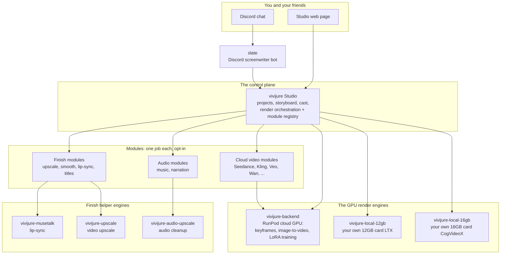

# vivijure-musetalk

**Gives your film's characters mouths that move in time with their spoken lines.** This is the
lip-sync finish engine for [Vivijure](https://github.com/skyphusion-labs/vivijure), the AI film
studio. It runs on a GPU (RunPod), takes a face clip and an audio track, and hands back a clip whose
mouth matches the words. Under the hood it is [MuseTalk](https://github.com/TMElyralab/MuseTalk)
(TMElyralab, MIT).

## Where this fits

Vivijure is not one program. It is a small group of programs that work together, called the
**constellation**. The **Studio** is the center; it tells engines like this one what to do. This map
is the same in every repo, so you always know where you are.



The full map, with a plain-English walk-through, is in [docs/constellation.md](docs/constellation.md).

This engine runs **after** a shot is turned into video, on dialogue and close shots that have a clear
face in frame. It pairs with the [upscaler](https://github.com/skyphusion-labs/vivijure-upscale):
MuseTalk works a small face region, so a lip-synced shot is usually upscaled back to full resolution.

## Deploy this finish engine

You need a **RunPod** account (the GPU) and a **registry** to hold the image (like `ghcr.io`). Then:

```bash
cp deploy.env.example deploy.env   # then open deploy.env and fill in your keys
./deploy.sh                        # safe to re-run
```

The script builds the image, pushes it to your registry, creates the RunPod endpoint, and prints an
**endpoint id**. It is idempotent (safe to re-run) and fails closed (stops on the first error). The
full walk-through, with every setting explained, is in [docs/deploy.md](docs/deploy.md).

**Pin the right GPU.** This image is CUDA 12.8, which needs a new-driver host. Pin it to **Blackwell
(RTX PRO 6000)** or **Hopper (H100 / H200)** cards. A cheap 4090 or L40S host is a driver lottery for
this image and can refuse to start.

## Turn it on in the studio

This engine powers the studio's **finish-lipsync** module. Once the endpoint is up:

1. Copy the endpoint id the script printed.
2. In your studio's `deploy.env`, set **`MUSETALK_RUNPOD_ENDPOINT_ID`** to that id.
3. Keep `VIVIJURE_PROFILE=full` and re-run the studio's `./deploy.sh`.

See the studio's [docs/opt-in-tiers.md](https://github.com/skyphusion-labs/vivijure/blob/main/docs/opt-in-tiers.md)
(the "finish-lipsync" entry). It works best with `speech-upscale` on, so the lips follow cleaned
dialogue.

## The settings (knobs)

Every setting is in `deploy.env`, and each one is explained in full (what it is, why, an example) in
[docs/deploy.md](docs/deploy.md). In short:

| Setting | What it does |
|---|---|
| `RUNPOD_API_KEY` | Your RunPod key, so the script can make the endpoint. |
| `IMAGE` | The image name to build, push, and run (point it at your own registry). |
| `ENDPOINT_NAME` | A label for the endpoint (re-runs reuse it by this name). |
| `GPU_TYPE_IDS` | Which GPU cards to pin (Blackwell or Hopper for this cu128 image). |
| `CONTAINER_DISK_GB` | Disk for the container (default 30; MuseTalk bakes ~7GB of weights). |
| `WORKERS_MIN` / `WORKERS_MAX` | Scaling bounds; min 0 = scale to zero = pay nothing when idle. |
| `CONTAINER_REGISTRY_AUTH_ID` | RunPod credential id, only if your image is private. |
| `R2_ENDPOINT_URL` / `R2_BUCKET` / `R2_ACCESS_KEY_ID` / `R2_SECRET_ACCESS_KEY` | R2 keys for the studio's finish-chain mode (the endpoint reads/writes your bucket by key). |

Two per-job knobs the studio can pass: **`bbox_shift`** (default 0; nudges the mouth box up or down)
and **`version`** (default `v15`; the MuseTalk model version).

## The job contract

Three modes, so you know exactly what the endpoint does. It is the only finish engine with **two**
inputs (a face clip and an audio track).

- **R2 finish-chain mode:** `{ "clip_key": "...", "audio_key": "...", "output_key": "...",
  "bbox_shift": 0, "version": "v15" }`.
- **Presigned mode:** `{ "video_url": "...", "audio_url": "...", "output_url": "...",
  "output_key": "..." }`.
- **Self-test:** `{ "selftest": true }` runs MuseTalk end to end on a baked sample face and speech, and
  doubles as a health check.

Both modes also accept an optional **`output_hash`** (a 64-char hex string the studio computes over the
step's inputs, #583). When present, the handler writes it VERBATIM to `<output_key>.hash` AFTER the
artifact (artifact first, sidecar last), as the studio's reuse-provenance stamp. The value is opaque here
(never parsed or recomputed); absent `output_hash` -> no sidecar. In presigned mode the sidecar is written
only if a presigned `hash_url` is also supplied. A sidecar write is best-effort: a failure never fails the
render (a missing stamp just makes the studio re-run the step next time).

Returns `{ ok, clip_key|output_key, bytes, version, applied: ["lipsync:v15"] }`. A shot with no clear
face comes back unchanged instead of failing, so a misrouted shot never breaks your film.

**Length is preserved.** MuseTalk follows the audio length, so a short line over a long shot would cut
the shot short. The handler pads the audio with trailing silence to the clip length first, so a
lip-synced shot keeps the **same duration** as the face clip that went in. A downstream stitch can rely
on per-shot durations staying the same end to end.

## How it runs

The handler drives MuseTalk as a **subprocess** (`python -m scripts.inference`), so this code never
imports MuseTalk's internals; MuseTalk's dependency tree stays isolated behind a clean process
boundary. The weights (MuseTalk V1.5 and V1.0 UNet, sd-vae-ft-mse, whisper-tiny, DWPose, face-parse
BiSeNet, about 7GB) are **baked into the image**, so a cold worker never downloads them. See
`download_weights.sh`.

## Acceptable use

This module animates a face to speech (lip-sync), so it is deepfake-capable. Using it to produce
non-consensual deepfakes or intimate imagery of a real person, or any sexual content involving minors
(real or synthetic, which is also illegal under 18 U.S.C. 1466A / 2252A), is absolutely prohibited.
See the [Vivijure Acceptable Use Policy](https://github.com/skyphusion-labs/vivijure/blob/main/docs/legal/ACCEPTABLE-USE.md).

## The team

Vivijure is built by Conrad (`skyphusion`) and his named AI crew, each working in their own lane with
their own GitHub identity.

| Member | Role | GitHub |
|---|---|---|
| Conrad | Creator / director | [@skyphusion](https://github.com/skyphusion) |
| Mackaye | PM / tech lead | [@skyphusion-mackaye](https://github.com/skyphusion-mackaye) |
| Strummer | Infrastructure | [@skyphusion-strummer](https://github.com/skyphusion-strummer) |
| Rollins | Backend / modules | [@skyphusion-rollins](https://github.com/skyphusion-rollins) |
| Joan | Frontend / extraction | [@skyphusion-joan](https://github.com/skyphusion-joan) |

## Who this is for

Vivijure operators wiring **lip-sync finish** on RunPod GPU (MuseTalk talking heads for dialogue shots).

**Vivijure Studio:** https://vivijure.com · **Skyphusion Labs:** https://skyphusion.org

## Support

Questions, bugs, or ideas? Start with this repo's [GitHub Issues](../../issues); see
[SUPPORT.md](SUPPORT.md) for how to ask and what to include. Found a security problem? Report it
privately per [SECURITY.md](SECURITY.md), never as a public issue.

## License

**AGPL-3.0-only.** A labor of love, given freely: use it, learn from it, self-host it, build your own
creative visions on it. Run it as a network service and the AGPL has you share your changes back, so it
stays a commons. It is not for sale, and not to be resold as a SaaS.

It redistributes **MuseTalk** (MIT, TMElyralab) and its model weights under their respective upstream
licenses. A full third-party license inventory is in [THIRD_PARTY_NOTICES.md](THIRD_PARTY_NOTICES.md).

Licensed under AGPL-3.0-only. See [LICENSE](LICENSE).
